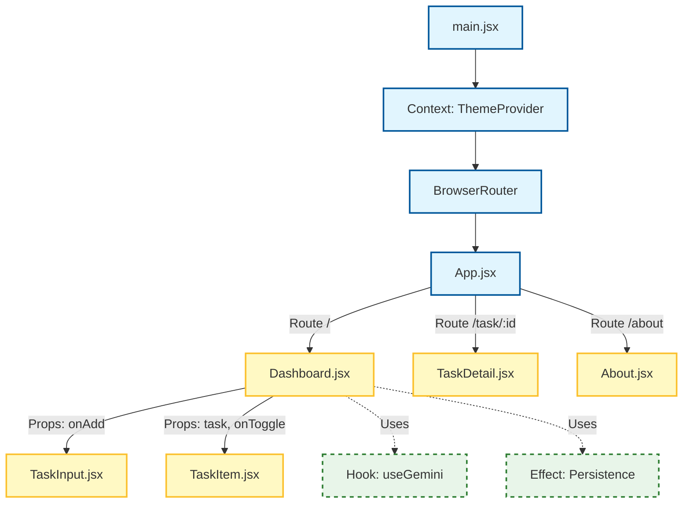

---

# Smart AI To-Do App (React Capstone)

A "Smart" Task Manager built with React, Vite, and Google Gemini AI. This project demonstrates mastery of modern React patterns including **Custom Hooks**, **Context API**, **Global State Management**, and **AI Integration**.

## Component Architecture

The following graph illustrates how data flows through the application and which components manage state vs. display UI.



---

## 📚 Curriculum Mapping (Feature vs. Lesson)

This project was built to satisfy specific learning outcomes. Here is how each component maps to the course lessons:

| Component / File | Functionality | **Lesson Covered** |
| --- | --- | --- |
| **`Dashboard.jsx`** | Manages the main list state (`tasks`) and CRUD logic. | **L4: State** |
| **`TaskItem.jsx`** | Receives data via props to display individual rows. | **L4: Props** |
| **`TaskInput.jsx`** | Uses Ant Design / CSS for layout. | **L5: UI Libraries** |
| **`useGemini.js`** | Async function to call Google Gemini API for subtasks. | **L6: Async & AI** |
| **`Dashboard.jsx`** | Uses `useEffect` to save tasks to `localStorage`. | **L7: Side Effects** |
| **`ThemeContext.jsx`** | Global Dark/Light mode provider to avoid prop drilling. | **L8: Context API** |
| **`App.jsx`** | Manages navigation between Dashboard, Details, and About. | **L9: Routing** |
| **`TaskDetail.jsx`** | Uses `useParams` hook to read the URL ID. | **L10: Hooks** |
| **`useGemini.js`** | A custom hook that isolates API logic from UI. | **L11: Custom Hooks** |
| **`About.jsx`** | Explains React vs. Vue/Angular state concepts. | **L12/13: Concepts** |
| **Vercel** | Project is hosted live with CI/CD. | **L14: Deployment** |

---

## Key Features

### 1. AI-Powered Task Breakdown

Instead of manually typing sub-tasks, users can click the **Magic Wand (✨)** button. The app sends the task to **Google Gemini 2.5**, which intelligently breaks it down into actionable steps.

* *Code Location:* `src/hooks/useGemini.js`

### 2. Global Theme Manager

Implemented a robust **Context Provider** to manage Dark/Light mode. The preference is persisted in local storage, ensuring the user's choice is remembered across sessions.

* *Code Location:* `src/context/ThemeContext.jsx`

### 3. Data Persistence

Tasks are automatically synchronized with the browser's Local Storage using `useEffect`. Data is never lost on refresh.

---

## How to Run Locally

1. **Clone the repository**
```bash
git clone https://github.com/your-username/smart-todo-app.git
cd smart-todo-app

```


2. **Install Dependencies**
```bash
npm install

```


3. **Setup Environment Variables**
Create a `.env.local` file in the root directory:
```env
VITE_GEMINI_API_KEY=your_google_api_key_here

```


4. **Run the App**
```bash
npm run dev

```